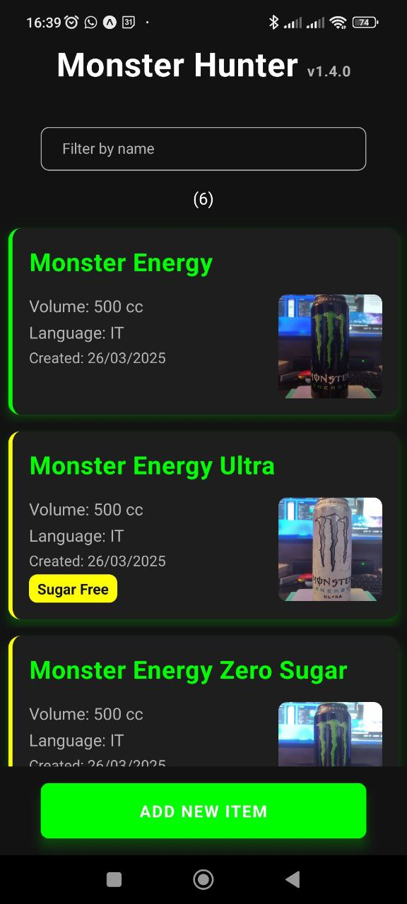
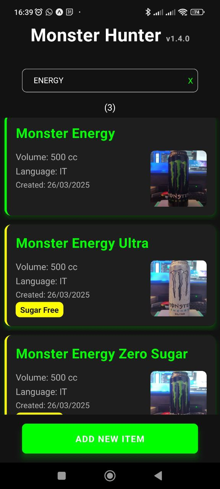
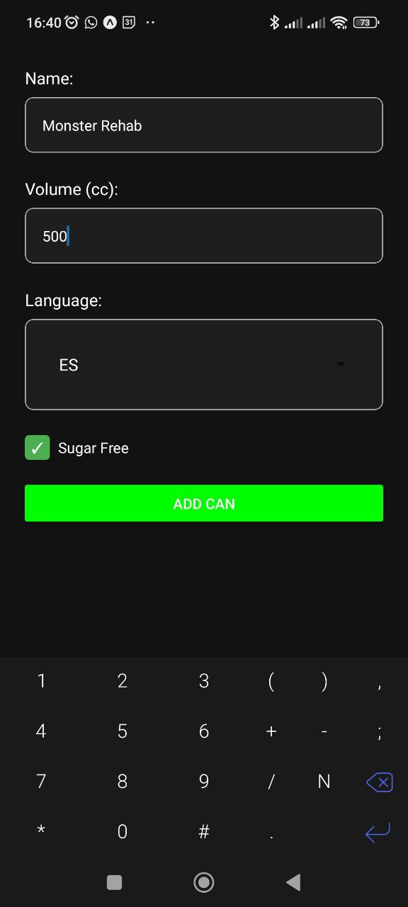
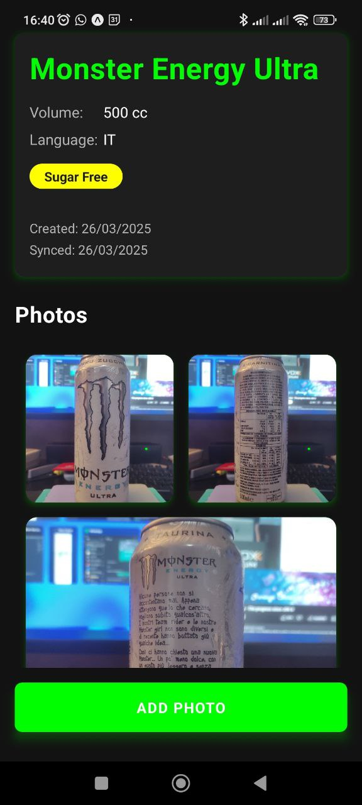
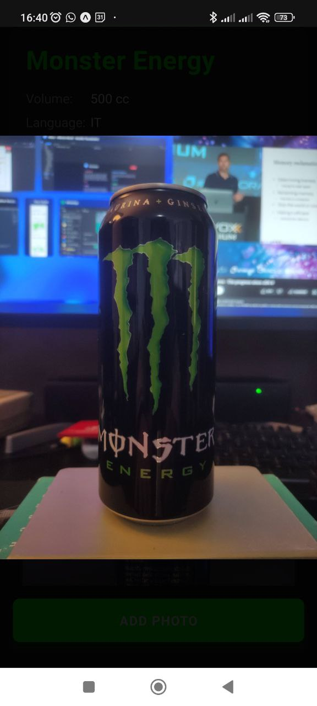
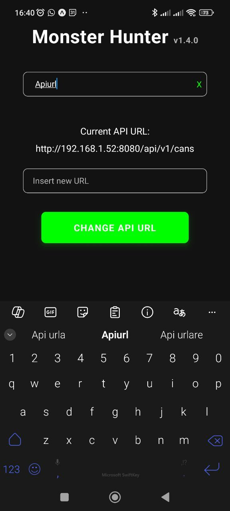

# MONSTER-HUNTER: frontend application

## Description

This project is a simple react-native frontend application ~~that interact with the spring backend~~ allowing users to keep track of their monster energy drink cans collection.
~~This app connects to the backend via a set of REST APIs. This app is built with Expo.~~

**Version 2.0 removed the backend integration, all of the data is saved on the device via Async-Storage**

## Usage

- run `npx expo start` to run and test with a mobile device or an android emulator
- run `expo build:android -t apk`to build the apk to install on the mobile device

## Available APIs

- ~~GET /api/v1/cans : returns the list of all cans~~
- ~~POST /api/v1/cans : insert a new can into the collection~~
- ~~GET /api/v1/cans/{id} : retrieve a can and its details by id~~
- ~~PUT /api/v1/cans/{id} : update a can's details~~
- ~~DELETE /api/v1/cans/{id} : delete a can from the collection~~

## Screenshots

_Browse through your collection with search functionality_

### Filtering

_Filter the collection by name_

### Add New Can

_Add new cans to your collection_

### Can Details

_View the can details and photos_

### Photo View

_View enlarged photos_

### API Configuration

_Configure the API endpoint_

## Versions

- 1.0.0 : initial version

  - retrieve and display the list of all the items in the collection;
  - filter the items by name;
  - added a clear button for the filter;
  - delete an item by swiping left on the list (after a prompt);
  - filtering by "apiurl" let you change the API_URL to connect to the remote APIs;

- 1.0.1 :

  - fixed the connection to the APIs from the deployed app, as in https://stackoverflow.com/questions/77157620/how-to-enable-http-requests-using-expo/79435980

- 1.1.0 :

  - added an insert functionality to add a new item to the collection (requires React Navigation);
  - refactoring of the project following guidelines and best practices;

- 1.2.0:

  - added "sugarfree" attribute to the cans;
  - added "sync_date" attribute to the cans to manage the sync with the remote db;
  - added "deleted" attribute to the cans to manage the logical deletion from the remote db;
  - filtering by "syncdate" shows date of the last synchronization with the remote db;
  - all the data now are saved locally to the device with _@react-native-async-storage/async-storage_ and synchronizated with the remote server via APIs;
  - useLocalDataStorage, useRemoteDataStorage and usdSynchronizer handle the different contexts and allows offline usage of the app and multiple device interaction with the db;
  - a function checks the connection with the remote server every time a synchronization is neeed: if the APIs are not reachable only the local data are modified, and will be synchronized the first time the APIs are available;

- 1.3.0:

  - added a detailed view for the cans, with an image gallery
  - added image handling: users can now add and delete photos for each can. Photos are picked from the device gallery and synchronized with the remote database

- 1.4.0
  - improved the style of the mobile app and refactored all the css info to improve the codebase
  - changed the app icon

- 2.0.0
  - the backend part has been removed, everything is stored on the device, via Async-Storage
  - the photos are stored in a directory, and not in the photo album
  - implemented an import/export system to backup and restore data (and photos) via JSON + zip for the photos

### Future implementations:

- barcode recognition (possibly a front-end feature)
